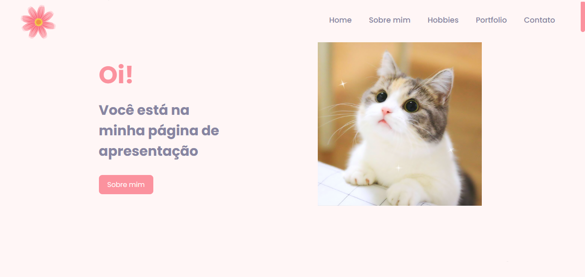
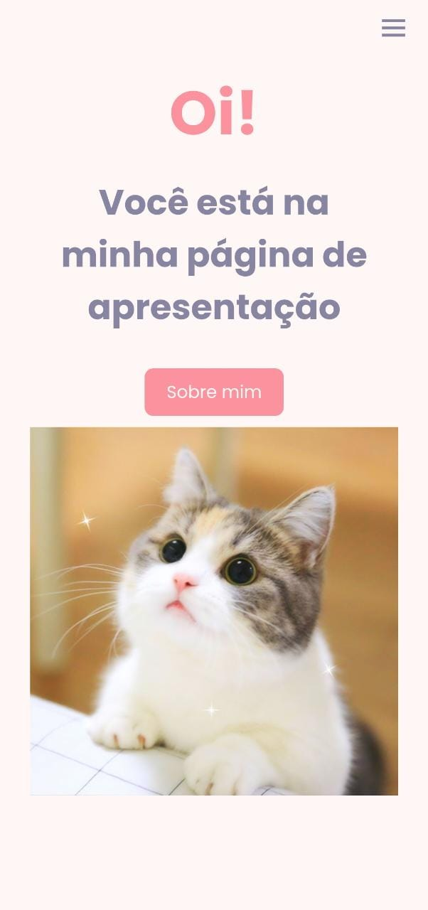

<h1  align="center"> :blossom: Meu Futuro Portfólio  </h1>

<h2> :high_brightness: Descrição da Página </h2>

Esse foi o meu primeiro projeto individual do curso Programadores Cariocas, você pode ver clicando <a href="https://daysecampos.github.io/meuPortfolio/">aqui</a>, acessando o link na descrição ou baixando! O objetivo era criar uma página para de apresentação, que em breve será mais trabalhada também como um portfólio. Ela tem as seguintes sessões, em uma página única:

<ul>
<li>Home</li>
<li>Sobre mim</li>
<li>Hobbies</li>
<li>Portfólio</li>
<li>Contato</li>
</ul>

Toda a página também foi estruturada com responsividade, então é possível acessá-la em qualquer dispositivo sem perder nenhuma funcionalidade. 

  

<h2> :cat: Tecnologias Utilizadas </h2>

<ul>
<li>HTML: Como de costume, toda a estrutura da página foi feita com o HTML. </li>
<li>CSS: Toda a página foi estilizada com as funções do CSS. </li>
<li>Javascript: Ele dá a funcionalidade para o menu responsivo. </li>
</ul>
